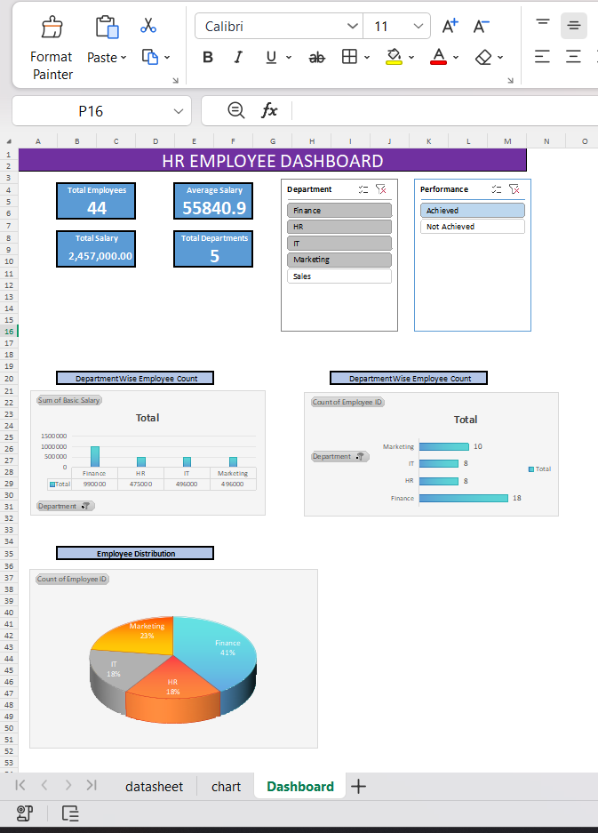

# HR Employee Dashboard

## Overview

An interactive HR Employee Dashboard built using Microsoft Excel to analyze employee data and visualize key HR metrics.

## Features

- KPI Cards
- Pivot Tables
- Pivot Charts
- Slicers
- Department-wise Analysis
- Salary Analysis
- Conditional Formatting
- VLOOKUP/XLOOKUP

## Tools Used

- Microsoft Excel

## Dashboard Preview

# hr-employee-dashboard-excel
Interactive HR Employee Dashboard built using Microsoft Excel
